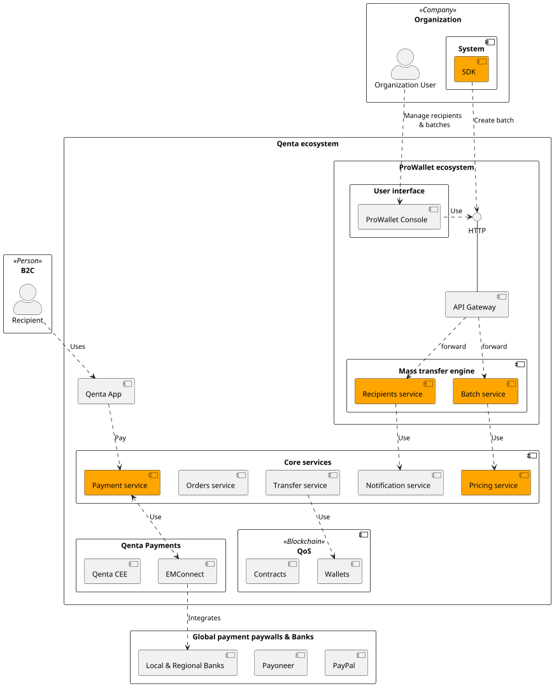
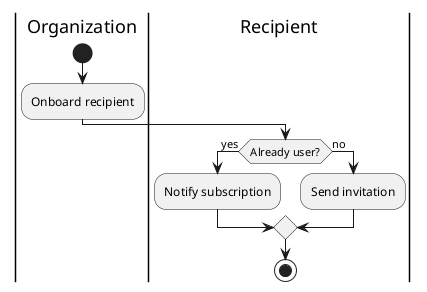

# Mass Transfers

## Reference architecture

## Managing Recipients

Before to include a recipient into a payment batch you need to onboard him. The recipient is the person that will receive the payment.

### Onboarding

