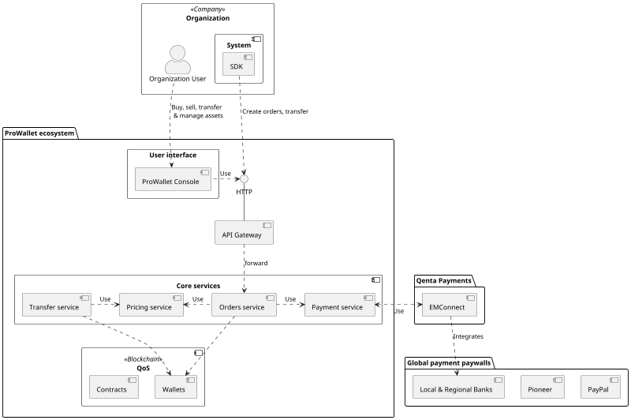

# Treasury management

## Reference architecture

```plantuml
@startuml

scale max 800 width
skinparam actorStyle awesome


rectangle "Organization" <<Company>> {
    component "System" {
        [SDK]
    }
    actor "Organization User" as OU
}

package "ProWallet ecosystem" {
    interface "HTTP" as HTTP
    HTTP -down- [API Gateway]
    
    rectangle "User interface" {
        [ProWallet Console]
    }
    
    component "Core services" as engine {
        [Transfer service]
        [Orders service]
        [Pricing service]
        [Payment service]
    }
    
    component "QoS" as BC <<Blockchain>> {
        [Wallets]
        [Contracts]
    }
    
}

package "Qenta Payments" {
    [EMConnect]
}

package "Global payment paywalls" {
    [PayPal]
    [Pioneer]
    [Local & Regional Banks]
}

OU .down.> [ProWallet Console] : Buy, sell, transfer \n & manage assets

[ProWallet Console] .left.> [HTTP] : Use
[SDK] .down.> [HTTP] : Create orders, transfer

[API Gateway] .down.> [Orders service] : forward
[Orders service] .left.> [Pricing service] : Use
[Orders service] .right.> [Payment service] : Use
[Transfer service] .right.> [Pricing service] : Use

[Transfer service] .down.> [Wallets]
[Orders service] .down.> [Wallets]

[Payment service] <.right.> [EMConnect] : Use
[EMConnect] .down.> [Local & Regional Banks] : Integrates

@enduml
```

## Purchase orders

